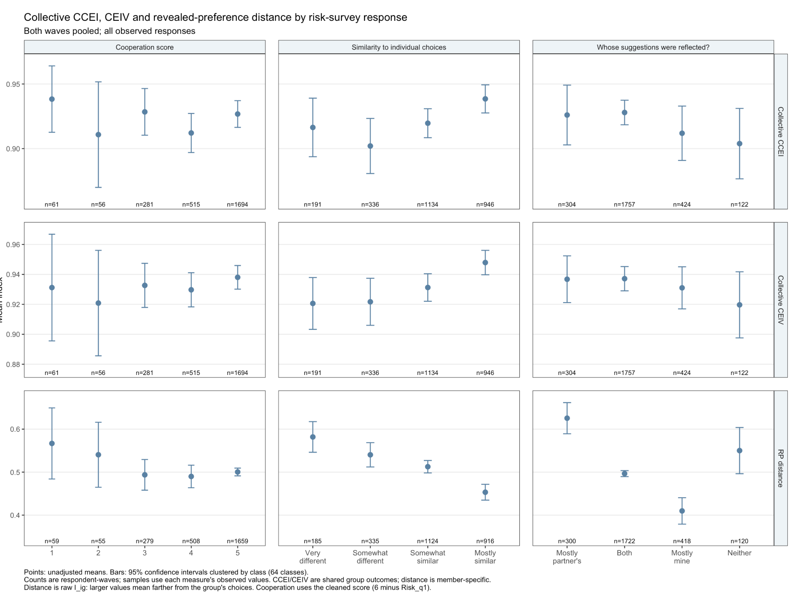

later: individual pair figures
later:  This is a great placebo material

TODO:
5. Generate appendix version of figure 6, where we exclude pairs whose all choices are at the corner or midpoint. Prepare two panels - a version that does not allow for any trembling hand, another version that allows for minimal trembling hand

6. Change the specificatin of table A9 so that we use low-high as the baseline caterogry. Then we don't have to show the postestimation results

7. Can we take a look at how figure 8 looks like with other covariates?

Completed 2026-10-09:
- Item 2: Table 3 and alternative-measure Table A5 include outcome means/SDs; old summary Table A6 removed from code and draft.
- Item 3: All 18 leave-one-choice-out folds and 108 fits completed; saved inputs, coefficients/SEs, diagnostics, workflow documentation, and manuscript table/discussion updated. The replacement table is now A6 after deleting the old summary.
- Item 4: All 500 reassignment repetitions and 3,000 fits completed; Figure 4 shows columns 2, 3, 5, and 6 in a 2x2 layout, with updated manuscript notes/discussion.
- Item 5: Exact and inclusive 2.5-point-buffer collective-choice exclusions added as Figure A24; retained N=1,228 and 1,018.
- Item 6: Low-High is the baseline; post-estimation rows removed. The categorical table is now A8 after deleting the old summary.
- Item 7: Math/friendship Figure 8 review saved in results/new_indices/section6_xxx/figure8_math_friendship_ame.png for discussion.
Item 1 remains a review figure pending the final selection; the accepted four-specification trial is in results/figure_A7_review.
